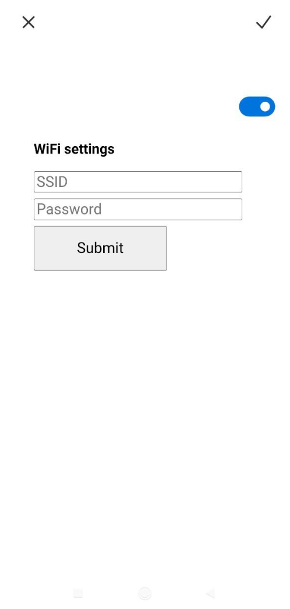
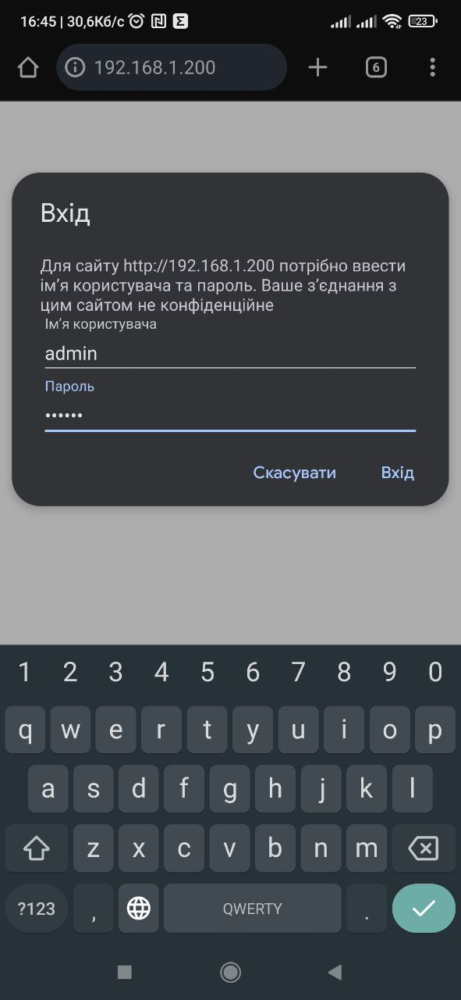
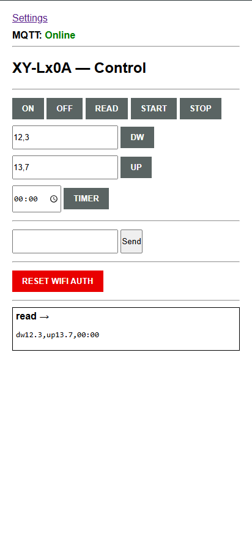
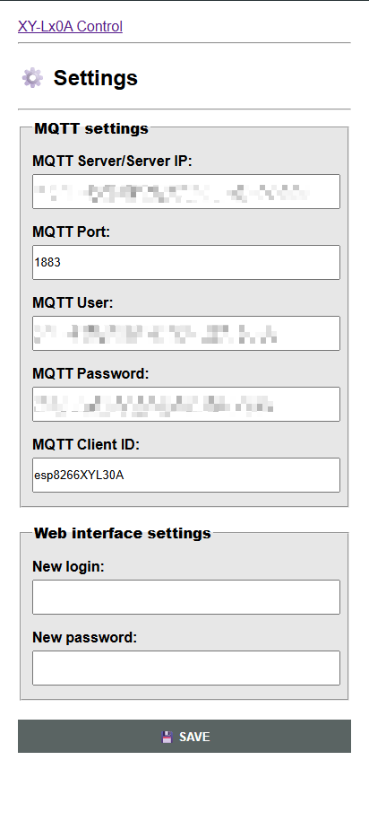

# Web panel (description & connect)

## Quick Start Guide: XY-LxxA Web Panel

### 1. **Initial Setup (First Time)**

1. **Power on** your ESP8266 with XY-LxxA firmware
2. **Connect to Access Point**:
   - Look for WiFi network: `XY-LXXA-Config`
   - Connect to it (no password required)
   - Your phone/computer should automatically open the configuration page
     _If not, open browser and go to: `192.168.4.1`_
     

3. **Configure WiFi**:
   - Enter your router's **SSID** and **Password**
   - Click **Submit**
   - The config AP will disappear

4. **Connection Status**:
   - ESP8266 LED will blink once per second during connection attempts
   - After 5 failed attempts, it returns to config mode
   - On success, LED pattern changes (usually steady or different blink)

### 2. **Accessing Web Panel**

1. **Get ESP8266 IP Address**:
   - Check serial monitor (baud rate 115200)
   - Look for message like: `Connected! IP address: 192.168.XXX.XXX`
     _Or check your router's connected devices list_

2. **Open Web Panel**:
   - In browser, enter: `http://[ESP_IP_ADDRESS]`
   - Example: `http://192.168.1.200`
     

3. **Login**:
   - Default credentials:
     - Username: `admin`
     - Password: `123456`
   - You can change these in `config.h` file or later in web panel

### 3. **Web Panel Interface**

| Main page   | Settings page.    |
| ------------------------------------------------- | ----------------------------------------------------------- |

#### **Main Page**

- Control buttons for XY-LxxA module:
  - **ON/OFF** - Power control
  - **READ** - Read current status
  - **START/STOP** - Start/stop operations
  - **DW/UP** - Decrease/Increase values
  - **TIMER** - Set timers
- **Manual Command Input**:
  - Enter custom UART commands
  - Click **SEND** to execute
- **Device Response Log** - Shows XY-LxxA responses
- **RESET WIFI AUTH** - Clears saved WiFi credentials

#### **Settings Page**

Two configuration sections:

1. **MQTT Settings**:
   - Broker address/port
   - MQTT username/password
   - Topic configuration

2. **Web Interface Settings**:
   - Change admin username/password
   - Save changes with **SAVE** button

### 4. **Key Features**

- **Two-way UART communication** with XY-L10A/XY-L30A
- **Dual control methods**:
  - Web panel interface
  - MQTT protocol
- **Persistent storage** in EEPROM for:
  - WiFi credentials
  - MQTT settings
  - Web panel login data
- **WiFi reset capability** via web panel or MQTT

### 5. **Troubleshooting**

| Problem                 | Solution                                             |
| ----------------------- | ---------------------------------------------------- |
| Can't find config AP    | Press reset button, wait 30 seconds                  |
| Can't connect to router | Check SSID/password, ensure 2.4GHz network           |
| Web panel not loading   | Verify IP address, check if ESP is connected to WiFi |
| Forgot login password   | Use serial monitor or reflash firmware               |
| XY-LxxA not responding  | Check UART connections, baud rate (usually 9600)     |

### 6. **Important Notes**

- **First boot always starts in config mode** (no stored WiFi settings)
- **5 connection attempts** before returning to config mode
- **Changes require saving** - use SAVE buttons in settings
- **Credentials stored in EEPROM** survive power cycles
- **Serial monitor** (115200 baud) provides debug information

### **Default Credentials Summary**

- Config AP: `XY-LXXA-Config` (no password)
- Web Panel: `admin` / `123456`
- Changeable via Settings → Web Interface settings

**Next Step**: Connect XY-L10A/L30A to power source and ESP8266 for full functionality.

_For detailed XY-LxxA commands, refer to the module's UART command documentation._
