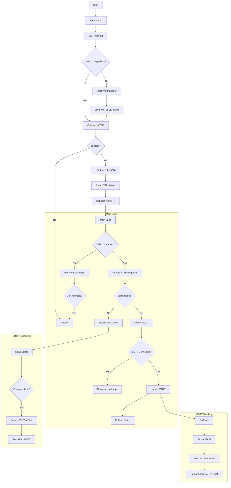

# Sketch logic

```mermaid
flowchart TD
    A[Start] --> B[Serial Setup]
    B --> C[EEPROM Init]
    C --> D{WiFi Config Exists?}
    D -- Yes --> E[Connect to WiFi]
    D -- No --> F[Start WiFiManager]
    F --> G[Save WiFi to EEPROM]
    G --> E
    E --> H{Success?}
    H -- No --> I[Reboot]
    H -- Yes --> J[Load MQTT Config]
    J --> K[Start HTTP Server]
    K --> L[Connect to MQTT]
    L --> M[Main Loop]

    subgraph Main Loop
        M --> N{WiFi Connected?}
        N -- No --> O[Reconnect Attempt]
        O --> P{Max Attempts?}
        P -- Yes --> I
        N -- Yes --> Q[Handle HTTP Requests]
        Q --> R{Serial Debug?}
        R -- No --> S[Read LoRa UART]
        R -- Yes --> T[Check MQTT]
        T --> U{MQTT Connected?}
        U -- No --> V[Reconnect Attempt]
        U -- Yes --> W[Handle MQTT]
        W --> X[Publish Status]
    end

    subgraph MQTT Handling
        W --> Y[Callback]
        Y --> Z[Parse JSON]
        Z --> AA[Execute Commands]
        AA --> AB[Restart/Blink/UART/Reset]
    end

    subgraph LoRa Processing
        S --> AC[Read Buffer]
        AC --> AD{Complete Line?}
        AD -- Yes --> AE[Parse XY-L30A Data]
        AE --> AF[Publish to MQTT]
    end
```
