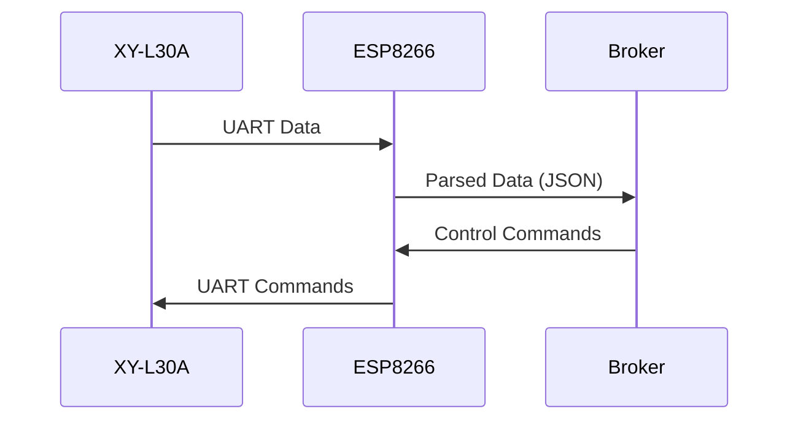
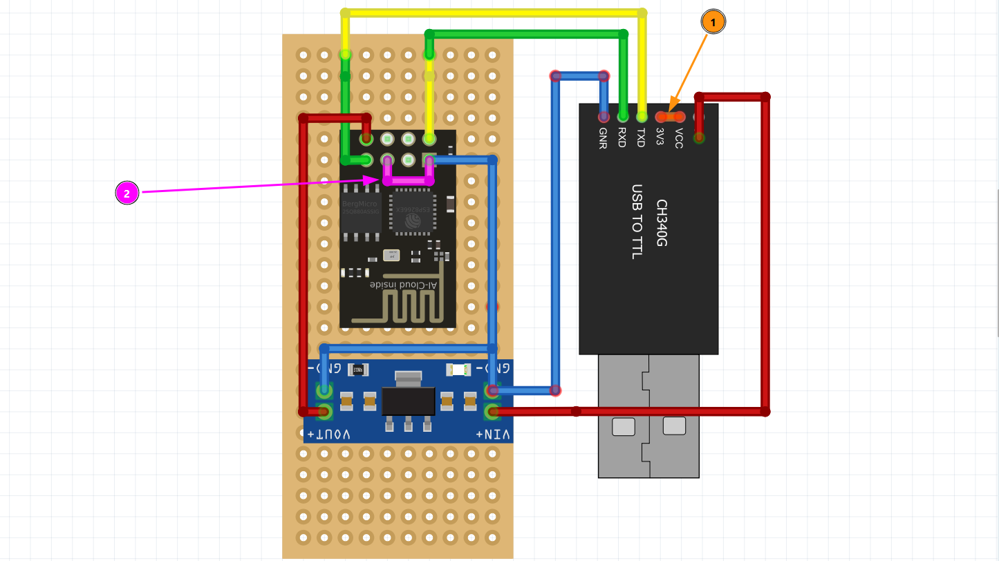
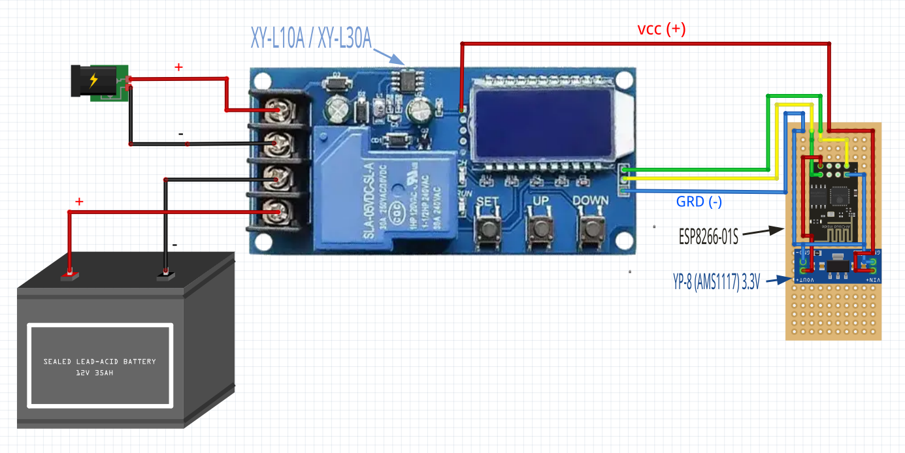
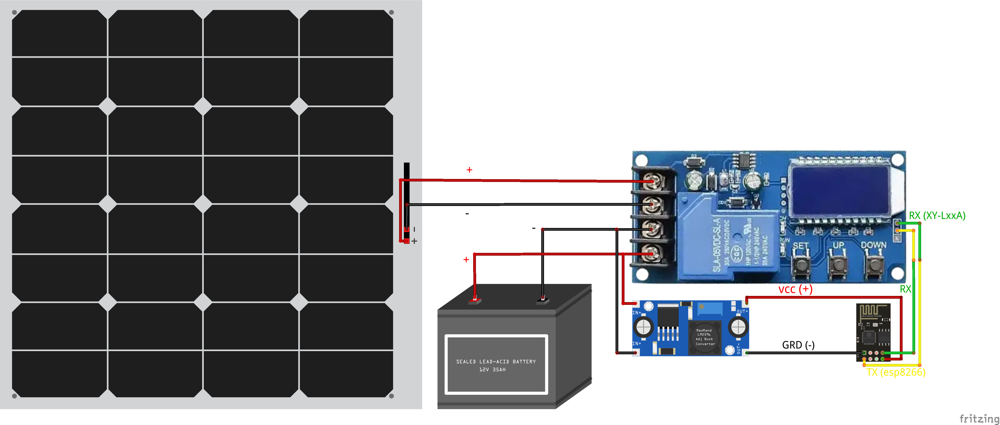

# ESP8266 with XY-L30A LoRa Gateway

## 📑 Table of Contents

0. [📌 Overview](#-overview)
1. [📋 Features](#-features)
2. [🛠 Hardware Requirements](#-hardware-requirements)
3. [⚙️ Software Configuration](#%EF%B8%8F-software-configuration)
4. [🔌 MQTT Topics](#-mqtt-topics)
5. [🎛 Commands (JSON Format)](#-commands-json-format)
6. [📊 Data Flow](#-data-flow)
7. [🔗 Programmer Connection Diagram](#-programmer-connection-diagram)
8. [🧩 Module Wiring Diagram](#-module-wiring-diagram)
9. [⚠️ Troubleshooting](#%EF%B8%8F-troubleshooting)
10. [📄 License](#-license)
11. [🤝 Contributing](#-contributing)

Other pages: [Project logic](BLOCK_SCHEMA.md) | [Web Panel Access, Control, Conf., etc.](Web-Panel.md)

## 📌 Overview

This project implements an ESP8266-based gateway that:

- Connects to WiFi (with fallback to AP configuration mode)
- Interfaces with XY-L30A LoRa module via SoftwareSerial
- Publishes sensor data to MQTT broker
- Provides web configuration interface (see: [Web Panel Access, Control, Conf., etc.](Web-Panel.md))
- Supports remote commands via build-in Web panel (see: [Web Panel Access, Control, Conf., etc.](Web-Panel.md))
- Supports remote commands via MQTT

## 📋 Features

- **Automatic WiFi Connection** with configuration portal fallback
- **MQTT Integration** with Last Will testament
- **Web Configuration** (HTTP server on port 80) read [About Web Panel](Web-Panel.md)
- **LoRa Data Processing**:
  - Battery status parsing
  - Configuration parameter extraction
  - Raw data forwarding
- **Remote Management**:
  - Device restart
  - LED control
  - UART passthrough
  - WiFi reset

## 🛠 Hardware Requirements

| Component   | Specification        |
| ----------- | -------------------- |
| ESP8266     | NodeMCU or similar   |
| LoRa Module | XY-L30A or XY-L10A   |
| Connections | RX: GPIO3, TX: GPIO1 |

## ⚙️ Software Configuration

1. **EEPROM Structure**:
   - WiFi SSID/PASSWORD
   - MQTT Server/Port/Credentials
   - Web interface credentials

1. **Default Web interface Credentials**:
   ```cpp
   // config.h
   #define DEFAULT_USER "admin"
   #define DEFAULT_PASS "password"
   ```

## 🔌 MQTT Topics

| Topic            | Direction | Description             |
| ---------------- | --------- | ----------------------- |
| `device/status`  | Out       | Device heartbeat (JSON) |
| `device/command` | In        | Control commands        |
| `lora/data`      | Out       | Parsed LoRa data        |
| `lora/config`    | Out       | Module configuration    |
| `lora/raw`       | Out       | Unprocessed UART data   |

## 🎛 Commands (JSON Format)

```json
{
  "action": "blink",
  "value": "3",
  "receiver": "device123"
}
```

Supported actions:

- `restart` - Reboot device
- `blink` - Blink LED (value = count)
- `uart_send` - Send raw data to LoRa module
- `reset_wifi` - Clear WiFi credentials

## 📊 Data Flow



## 🔗 Programmer Connection Diagram



Modules list:

1.  Programmer CH340G
1.  ESP8266 / ESP8266-01s
1.  YP-8 (AMS1117) 3.3V

## 🧩 Module Wiring Diagram

### With constant power supply



Modules list:

1.  XY-L10A / XY-L30A
1.  ESP8266 / ESP8266-01s
1.  YP-8 (AMS1117) 3.3V

### With Solar panel as power supply



Modules list:

1.  XY-L10A / XY-L30A
1.  ESP8266 / ESP8266-01s
1.  LM2596 (DC-DC Step-Down Converter)

## ⚠️ Troubleshooting

1. **Serial Debug Conflict**:
   - Set `IS_SERIAL_DEBUG` to `false` for LoRa UART operation
2. **WiFi Connection Issues**:
   - Reset Wifi credentials in module web interface
3. **MQTT Problems**:
   - Verify broker address/credentials in web interface

## 📄 License

MIT License - See [LICENSE](LICENSE) file

## 🤝 Contributing

We welcome your improvements! To make changes:

1. [**Fork** this repository](https://github.com/BorisKotlyarov/xy-l30a-esp8266-firmware/fork)
2. **Create a branch** for your changes:
   ```bash
   git checkout -b fix/my-improvement
   ```
3. **Make your changes**, ensuring:
   - Changes work on actual hardware
   - Examples compile without errors
4. **Commit your changes:**
   ```bash
   git commit -m "Fix: brief description"
   ```
5. **Push to your fork:**
   ```bash
   git push origin fix/my-improvement
   ```
6. **Create a Pull Request** with a description of your changes

Thanks for your contribution! ✨
