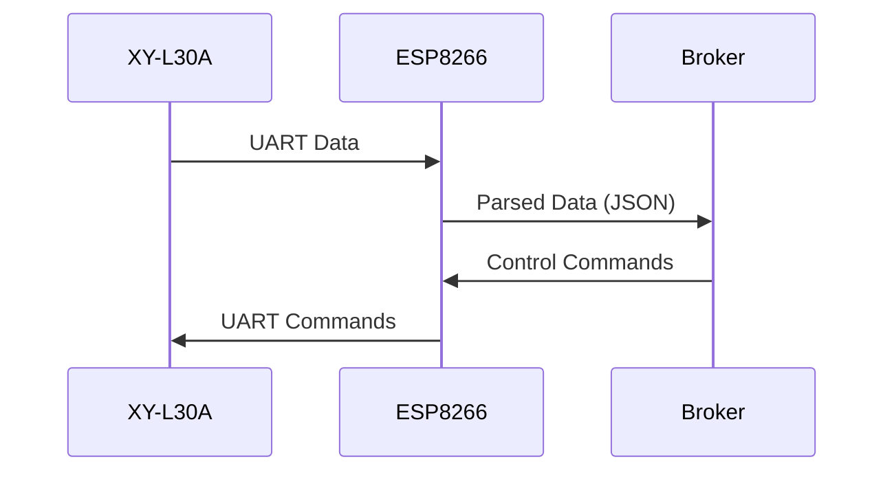

# ESP8266 with XY-L30A LoRa Gateway

[Project logic](BLOCK_SCHEMA.md)

## 📑 Table of Contents

1. [📌 Overview](#%F0%9F%93%8C-overview)
2. [📋 Features](#%F0%9F%93%8B-features)
3. [🛠 Hardware Requirements](#%F0%9F%9B%A0-hardware-requirements)
4. [⚙️ Software Configuration](#%E2%9A%99%EF%B8%8F-software-configuration)
5. [🔌 MQTT Topics](#%F0%9F%94%8C-mqtt-topics)
6. [🎛 Commands (JSON Format)](#%F0%9F%8E%9B-commands-json-format)
7. [📊 Data Flow](#%F0%9F%93%8A-data-flow)
8. [⚠️ Troubleshooting](#%E2%9A%A0%EF%B8%8F-troubleshooting)
9. [📄 License](#%F0%9F%93%84-license)

## 📌 Overview

This project implements an ESP8266-based gateway that:

- Connects to WiFi (with fallback to AP configuration mode)
- Interfaces with XY-L30A LoRa module via SoftwareSerial
- Publishes sensor data to MQTT broker
- Provides web configuration interface
- Supports remote commands via MQTT

## 📋 Features

- **Automatic WiFi Connection** with configuration portal fallback
- **MQTT Integration** with Last Will testament
- **Web Configuration** (HTTP server on port 80)
- **LoRa Data Processing**:
  - Battery status parsing
  - Configuration parameter extraction
  - Raw data forwarding
- **Remote Management**:
  - Device restart
  - LED control
  - UART passthrough
  - WiFi reset

## 🛠 Hardware Requirements

| Component   | Specification        |
| ----------- | -------------------- |
| ESP8266     | NodeMCU or similar   |
| LoRa Module | XY-L30A or XY-L10A   |
| Connections | RX: GPIO3, TX: GPIO1 |

## ⚙️ Software Configuration

1. **EEPROM Structure**:
   - WiFi SSID/PASSWORD
   - MQTT Server/Port/Credentials
   - Web interface credentials

1. **Default Web interface Credentials**:
   ```cpp
   // config.h
   #define DEFAULT_USER "admin"
   #define DEFAULT_PASS "password"
   ```

## 🔌 MQTT Topics

| Topic            | Direction | Description             |
| ---------------- | --------- | ----------------------- |
| `device/status`  | Out       | Device heartbeat (JSON) |
| `device/command` | In        | Control commands        |
| `lora/data`      | Out       | Parsed LoRa data        |
| `lora/config`    | Out       | Module configuration    |
| `lora/raw`       | Out       | Unprocessed UART data   |

## 🎛 Commands (JSON Format)

```json
{
  "action": "blink",
  "value": "3",
  "receiver": "device123"
}
```

Supported actions:

- `restart` - Reboot device
- `blink` - Blink LED (value = count)
- `uart_send` - Send raw data to LoRa module
- `reset_wifi` - Clear WiFi credentials

## 📊 Data Flow



## ⚠️ Troubleshooting

1. **Serial Debug Conflict**:
   - Set `IS_SERIAL_DEBUG` to `false` for LoRa UART operation
2. **WiFi Connection Issues**:
   - Reset Wifi credentials in module web interface
3. **MQTT Problems**:
   - Verify broker address/credentials in web interface

## 📄 License

MIT License - See [LICENSE](LICENSE) file
